# Laravel from the scratch
----------------------------------------------------------------
Para empezar con estos trabajos, vamos a implementar las indicaciones según el curso de laracasts

## **Primera parte**
### Como una ruta carga las vistas:
----------------------------------------------------------------
- Como prueba inicial, cambiamos en texto a "strong" para que las letras cambiaran a negrita y así poder ver los cambios realizados, esto se realiza en la carpeta de views

- Como segunda instancia, cambiamos las rutas para así entender como funcionan las mismas.

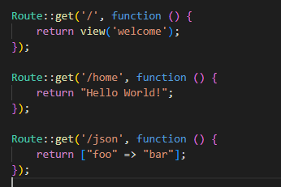

- Como tercera parte, se realizaron cambios en las rutas para que cuando indicaramos la ruta establecida, esta mostrara un "Hello World!"
- Tambien se creó otra ruta que mostrara un foo bar para cargar un json file

## **Segunda Parte**
### Incluyendo CSS y JavaScript:
----------------------------------------------------------------
- Para dar inicio a esta segunda parte, cambiamos la pagina "Welcome" en la carpeta de views, eliminamos todo lo que ahí aparecía y colocamos un title nuevo.

- Como segundo ejercicio para el desarrollo de esta parte del trabajo, modificamos el background de la pagina y el color de la letra con un archivo llamado app.css

- Luego realicé el mismo procedimiento, esta vez usando un archivo llamado app.js, el cual permite enviar un mensaje de alerta que tiene como contenido un mensaje que yo mismo le proporcioné.

## **Tercera Parte**
### Creando rutas y conectandolas:
----------------------------------------------------------------
- Para empezar con este procedimiento debemos cambiar la view de welcome por el nombre post y cambiamos algunos atributos del archivo css

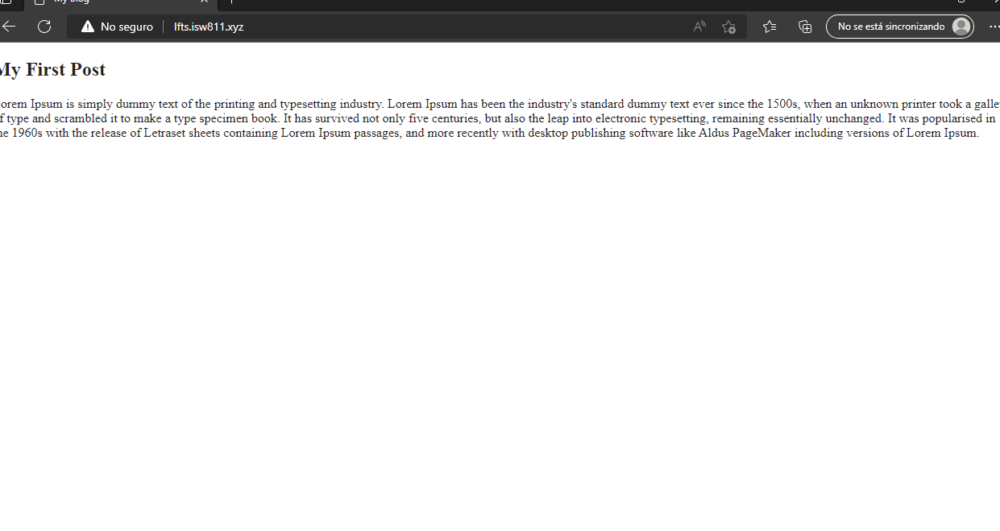

- Seguidamente procedí a darle un poco de formato al css, tal como se evidenciaba en el video, usando la etiqueta body y la etiqueta p

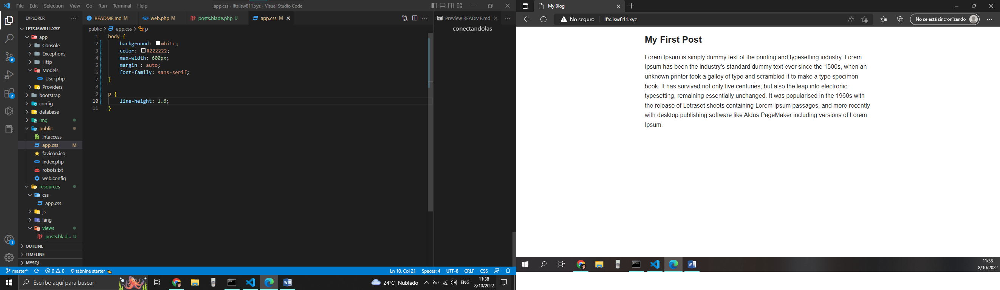

- Agregamos más titulos con textos a la vista con el formato establecido en el css mencionado anteriormente

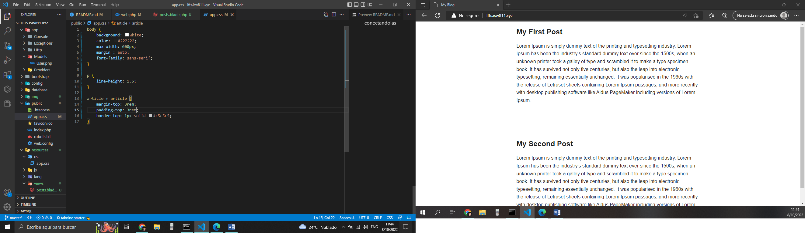

- Editamos los títulos para que estubieran en formato link para poder conectar pantallas o vistas entre si y hacer un poco más dinámica la interacción entre ellas.

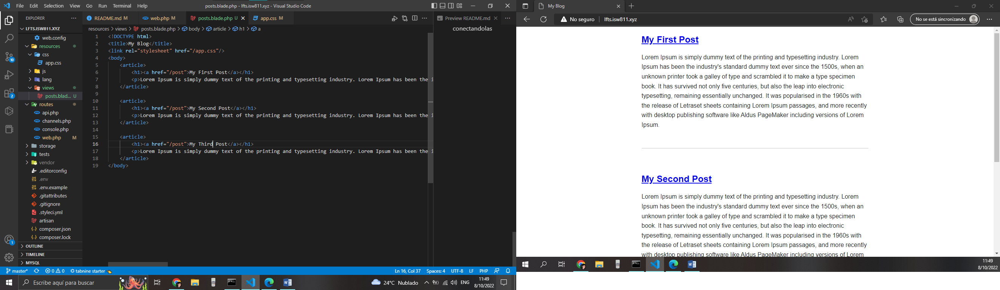

## **Cuarta Parte**
### Almacenando el blog como un archivo html:
----------------------------------------------------------------
- Este modulo lo comenzamos primeramente haciendo unos cambios a las rutas donde se muestra un hello world! mediante un enrutamiento diferente al que estamos acostumbrados, algo asi como enviandolos por parametros.

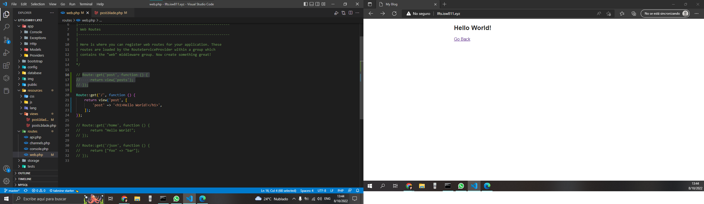

- Creamos una carpeta posts donde almacenaremos los diferentes archivos html que queramos usar en un futuro, en este caso son los post de los videos.

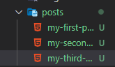

- Al crear las carpetas, podemos seguir modificando la ruta para que mediante la URL reciba el nombre del post que quiero mostrar, este vaya a la carpeta que contiene el html y lo renderice en pantalla

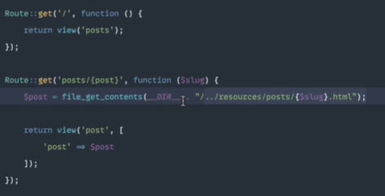

- Al momento de realizar el paso anterior, puede surgir el problema de que el usuario ingrese en la URL una ruta que no existe, por ejemplo, si el usuario ingresa el nombre "my-other-post" el sistema se va a dirigir a la carpeta de posts y no va a encontrar el archivo html, por ende debemos validar que si el archivo o la ruta no existe vamos a hacer un dump die y mostrar un mensaje de que la ruta no existe.

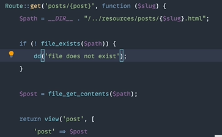

- Finalmente, luego de haber validado la ruta para que encuentre el archivo html por parámetro, cambiamos los href de las etiquetas "a" que hay en los archivos html para que este las encuentre en la ruta.

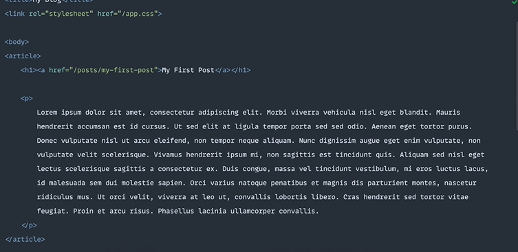

## **Quinta Parte**
### Restricciones de las rutas:
----------------------------------------------------------------
Basados en el episodio anterior, logramos hacer que el sistema encontrara las rutas que teniamos guardadas en la carpeta posts, pero surge un problema, este problema es que la variable $slug ouede ser cualquier cosa, por consiguiente realizamos esto:
- Luego de que cerramos todo el código de la ruta, colocaremos un where, donde validaremos que lo que obtenga de la ruta solo sean números, letras, alfanumericos, o bien uno que otro signo distintivo como un underscore.

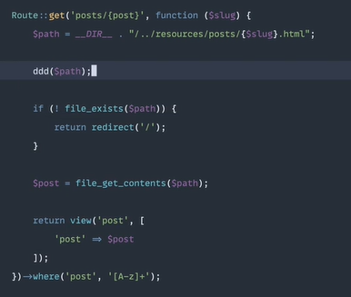

- Presentado lo anterior, funciona casi perfecto, el unico inconveniente es que cuando querramos entrar a los posts guardados anteriormente, nos los va a encontrar por los guiones que tienen en los nombres, ejemplo, my-first-post, por ende validaremos los guiones.

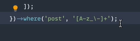

## **Sexta Parte**
### Utilizando el almacenamiento cache para operaciones costosas:
----------------------------------------------------------------
En este apartado haremos que se guarde en la cache la pagina que pasemos por parametros durante 5 segundos usando la ruta que establecimos anteriormente tal que así:

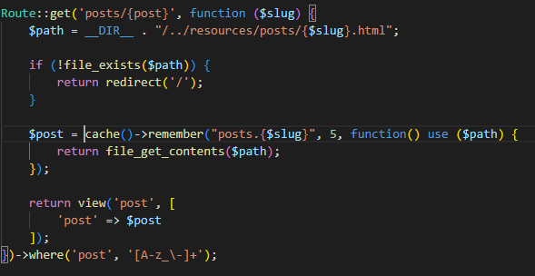

Mostramos un mensaje con un var_dump y se ve así:

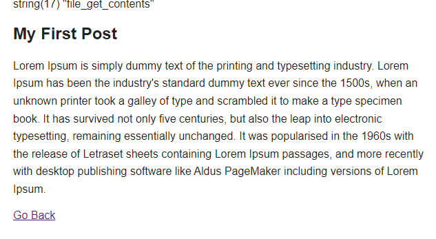

Luego, al refrescar la pagina despues de 5 segundos, el mensaje desaparece.

- Otra manera de realizar la ruta, una manera más corta:

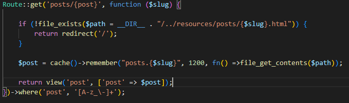

## **Setima Parte**
### Usar la clase del sistema de archivos para leer un directorio:
----------------------------------------------------------------
En este episodio nos explican que el codigo de la ruta que tenemos está bien, pero es algo desagradable, se menciona que muchas de las veces los profesionales utilizan comentarios en los metodos para saber que quieren hacer y de ahí obtienen las palabras clave o los keywords para realizar el código, tal que así:

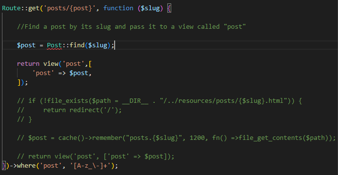

Ahora creamos el modelo Post con la clase denominada con el mismo nombre, dentro de esta realizaremos un método público llamado find que nos servirá para encontrar los elementos html utilizando el código que tenemos comentado en la imagen anterior con unos pequeños cambios:

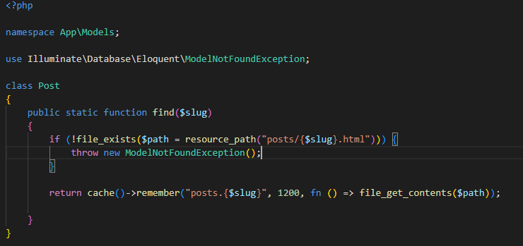

**Ahora haremos dinámico el apartado de artículos.**

En la ruta de la pagina principal, cambiamos un poco el cofigo para que este mostrara los archivos de forma dinámica.

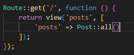

Seguidamente, en la clase Post realizamos una función pública, donde importamos la libreria File y retornamos lo que tenga la ruta de resources en la carpeta posts.

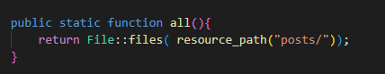

Al terminar con estos 2 procesos la vista quedaría algo así:

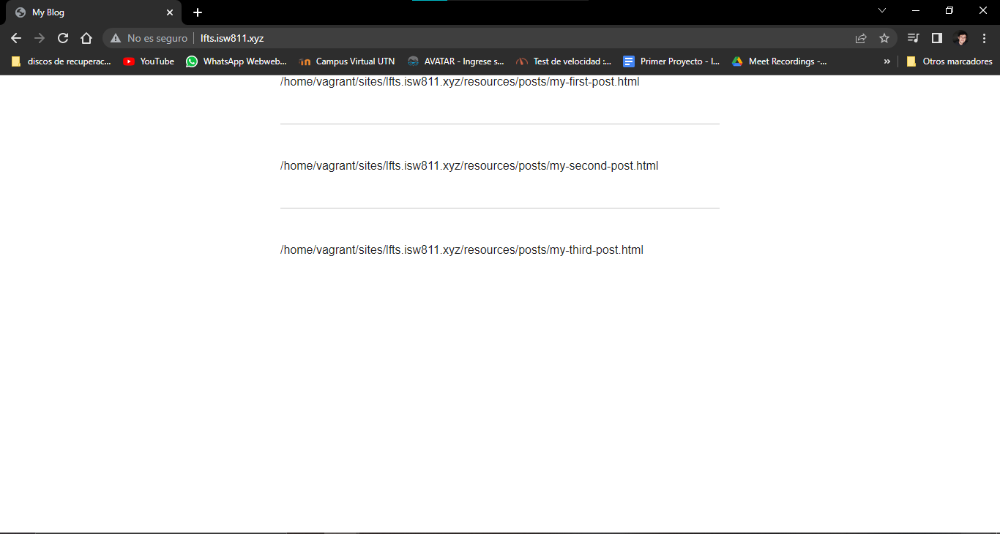

Se le realizaron cambios al metodo "all()" para que se mostrara el contenido de la carpeta posts

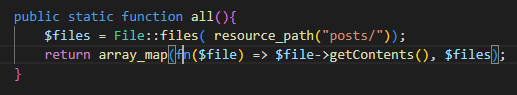

y de igual manera se realizó el cambio en la ruta para que mostrara lo que queriamos ver, lo que da como resultado: 

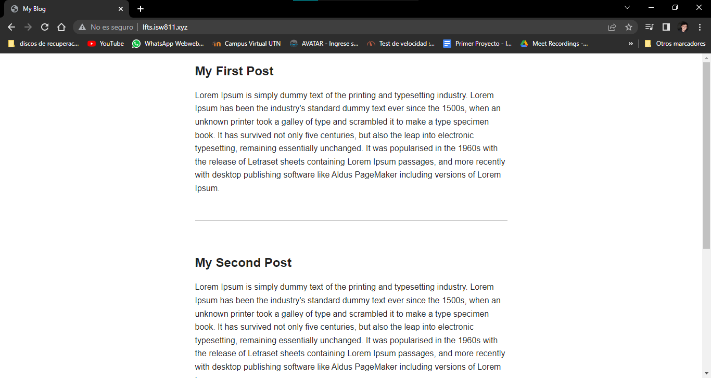

Como resultado de que el sitio ya es dinámico, agregamos un archivo html nuevo llamado my-fourth-post y obtenemos como resultado: 

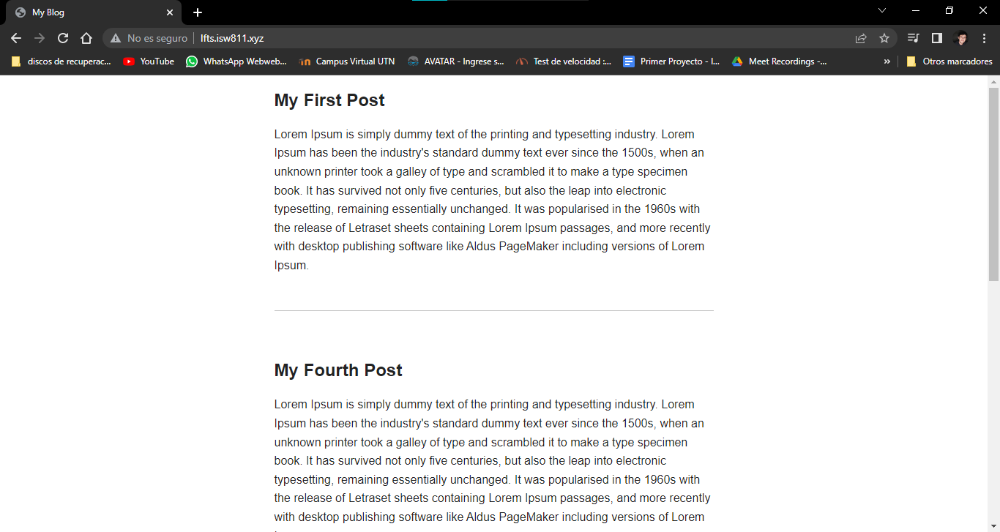

## **Octava Parte**
### Encontrar un paquete Composer para publicar metadatos:
---------------------------------------------------------------- 
Para iniciar con este episodio, debemos, primeramente instalar una libreria llamada yaml.
Importamos la libreria y con esta parseamos la ruta donde se encuentra el documento, tal que así:

Seguidamente generamos un arreglo en el cual incluiremos todo aquellos html que se almacenen en la ruta que estamos utilizando:

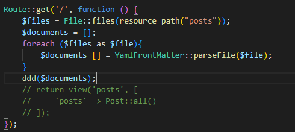

Dentro de la clase Post, declaramos 4 variables: Titulo, Extracto, fecha y cuerpo junto a su constructor

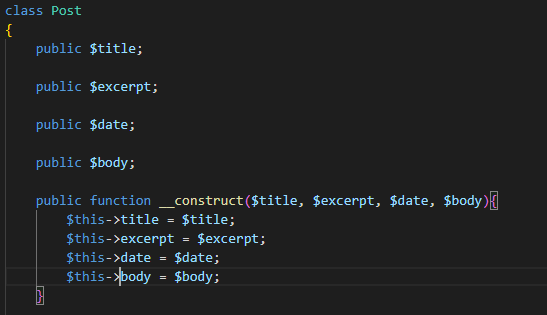

Luego de crear el constructor con sus respectivas variables, implementamos los cambios a la ruta y se vería algo así:

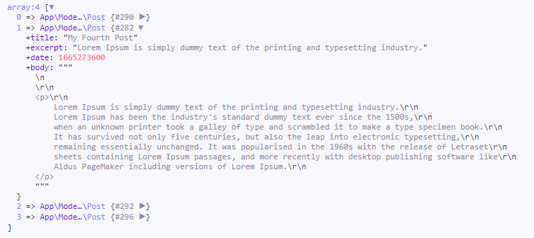

Como se puede apreciar en la imagen adjunta, implementamos en nombre, fecha, etc... En los campos asignados para cada uno en el constructor.

Una vez realizados todos estos cambios, ya tenemos más control sobre el reder de la pagina principal, implementando simplemente: 

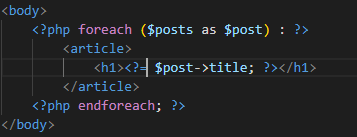

podremos mostrar las partes de los html, es decir, tal como se muestra en la imagen anterior, el resultado en el navegador sería el siguiente:

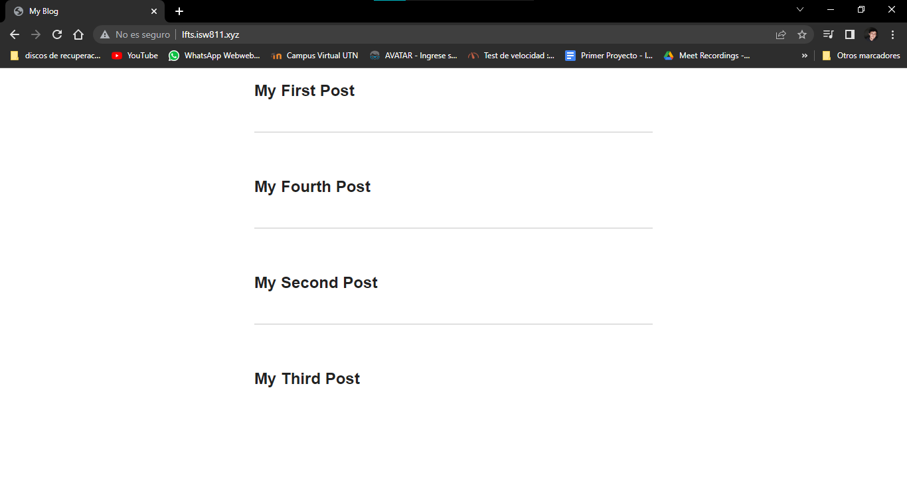

Posterior a lo mostrado anteriormente, simplemente agregamos en el constructor una opción llamada slug la cual va a permitire leer mediante el metadata la página o html al que queremos acceder, luego lo direccionamos con una etiqueta "a" y queda así:

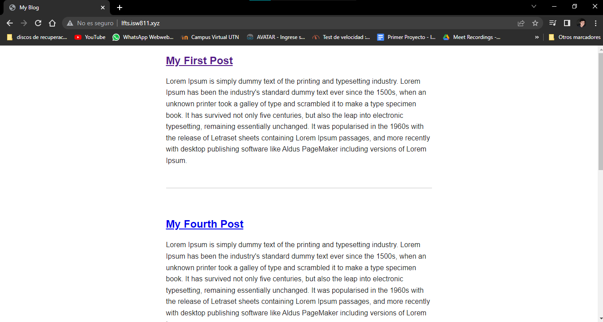

Continuamente se realizaron cambios en el codigo de la ruta para que fuese menos extenso, luego este se agregó al metodo "all()" creado en videos anteriores y en la ruta llamamos a la clase con el metodo y da como resultado la misma imagen mostrada anteriormente.

A continuación, modificaremos el método find, para que este encuentre el documento que se le está enviando por parámetro y el metodo quedaría así:

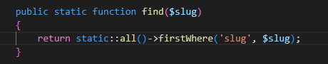

## **Novena Parte**
### Actualización de clasificación y almacenamiento en caché de colecciones:
---------------------------------------------------------------- 
Para este episodio, solo acomodamos los html con un sortBy y luego implementamos que la cache se recordara siempre, para que almacene todo lo que vayamos haciendo en nuestra página

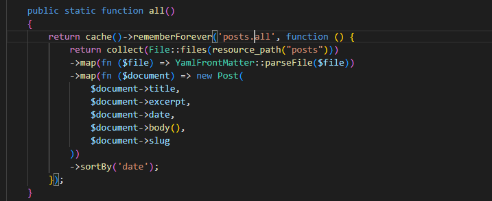

[BLADES](./entregables/blades.md)