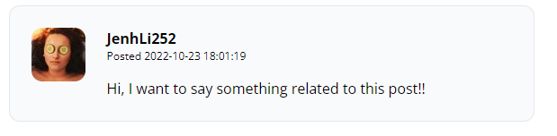

# Laravel from the scratch

En esta sección vamos a trabajar con comentarios.

--------------------------------------------------------

## **Primera parte**
### Escribir el marcado para un comentario de publicación:
--------------------------------------------------------

Para empezar, en este capítulo, nos vamos a dirigir a donde cierra el *"article"* y vamos a establecer una etiqueta *"section"*,
dentro de este *"section"* abriremos otro *"article"* y este será de clase *"flex"*, seguidamente abrimos 2 etiquetas *"div"* y en una de ellas estableceremos un avatar, de momento no lo tenemos, entonces vamos a cargar un link que nos va a propiciar una imagen random para nuestro avatar.
Entonces tendremos lo siguiente:

        <section>
            <article class="flex">
                

                    
                

                
                

            </article>
        </section>

Luego en la sección principal, es decir, dentro de nuestra segunda etiqueta *"div"* abriremos un *"header"* y establecemos un encabezado:

        <section>
            <article class="flex">
                

                    
                

                
                

                    <header>
                        <h3 class="font-bold">Jenhson Lizano</h3>
                        
Posted
                        <time>8 months ago</time>

                    </header>
                

            </article>
        </section>

Luego establecemos un comentario random debajo del *"header"*

        <section>
            <article class="flex">
                

                    
                

                
                

                    <header>
                        <h3 class="font-bold">Jenhson Lizano</h3>
                        
Posted
                        <time>8 months ago</time>

                    </header>
                     

                        Lorem ipsum dolor sit amet, consectetur adipiscing elit, 
                        sed do eiusmod tempor incididunt ut labore et dolore magna aliqua. 
                        Ut enim ad minim veniam, quis nostrud exercitation ullamco laboris nisi ut aliquip ex ea commodo consequat. 
                        Duis aute irure dolor in reprehenderit in voluptate velit esse cillum dolore eu fugiat nulla pariatur.
                    

                

            </article>
        </section>

Al implementar el código anterior, podemos observer que este al momento de ser renderizado en el navegador no tiene un estilo, para eso solo vamos a la parte de *"section"* y le damos un class, tal que así:

        <section class="col-span-8 col-start-5 mt-10">
            <article class="flex">
                

                    
                

                
                

                    <header>
                        <h3 class="font-bold">Jenhson Lizano</h3>
                        
Posted
                        <time>8 months ago</time>

                    </header>
                     

                        Lorem ipsum dolor sit amet, consectetur adipiscing elit, 
                        sed do eiusmod tempor incididunt ut labore et dolore magna aliqua. 
                        Ut enim ad minim veniam, quis nostrud exercitation ullamco laboris nisi ut aliquip ex ea commodo consequat. 
                        Duis aute irure dolor in reprehenderit in voluptate velit esse cillum dolore eu fugiat nulla pariatur.
                    

                

            </article>
        </section>

y seguimos dandole diseño a este comentario que hemos creado.
Una vez que tenemos todo el artículo completo, lo vamos a cortar y lo vamos a colocar en un archivo aparte para que este pueda ser usado en otros sitios de la app, tal como hicimos con los posts, etc... y una vez hecho esto, podremos ver nuestro comentario recién creado en los diferentes *posts* de nuestra app.

--------------------------------------------------------

## **Segunda parte**
### Coherencia de tabla y restricciones de clave externa:
--------------------------------------------------------

Lo que haremos ahora será crear un modelo exclusivo para los comentarios con el código que ya hemos usado anteriormente:

> ***php artisan make:model Comment -mfc***

>**"-mfc"** *significa que vamos a hacer una migración, un factory y un controlador asociado* al mismo tiempo

Luego de haber realizado el paso anterior, nos vamos a la migración recién creada y vamos a agregar algunos campos a la tabla de *commets* tales como las llaves foráneas de los *posts* y de los *users* y por supuesto, debemos agragar un *body* el cual es el que va a almacenar el comentario que vamos a mostrar en el navegador, ejemplo:

    public function up()
        {
            Schema::create('comments', function (Blueprint $table) {
                $table->id();
                $table->unsignedBigInteger('post_id');
                $table->unsignedBigInteger('user_id');
                $table->text('body');
                $table->timestamps();
            });
        }

y hacemos un:

>**php artisan migrate**

para aplicar los cambios.

En caso de no contar con la app que usa el guía en sus videos, como es mi caso, vamos a ingresar datos a nuestra tabla *comments* desde la consola, para esto, vamos a implementar el siguiente código en la consola:

> ***INSERT INTO table_name (column_1, column_2, column_3, ...) VALUES ('value_1', 'value_2', 'value_3', ...);***

En caso de que un post sea eliminado y no hayamos programado esta situación, vamos a obtener un error y nuestra app se va a caer, por eso debemos hacer en la migración un *$table-foreign* para evitar estos problemas, debemos programar de que en caso de que un post sea eliminado, se eliminen tambien las referencias que este tenía.

Nuestra migración quedaría así:

    public function up()
        {
            Schema::create('comments', function (Blueprint $table) {
                $table->id();
                $table->unsignedBigInteger('post_id');
                $table->unsignedBigInteger('user_id');
                $table->text('body');
                $table->timestamps();

                $table->foreign('post_id')->references('id')->on('posts')->cascadeOnDelete();
            });
        }

Hacemos un *rollback* a la migración y la volvemos a correr para que se apliquen los cambios.

Para comprobar que lo que acabamos de hacer funciona, vamos a hacer un delete del *posts* al que estamos haciendo referencia con el *comment*, es decir, si en la tabla *comments* en la columna *post_id* tenemos el "1" entonces iremos a hacer un *delete* de ese post, ejemplo:

- **Para insertar en *comments***

    > ***INSERT INTO comments (post_id, user_id, body, created_at, updated_at) VALUES ('1', '1', 'Hello World', NOW(), NOW());***

- **Para eliminar un post**

    > ***DELETE FROM posts WHERE id = 1;***

- **Hacemos un select de los comments**

    > ***SELECT * FROM comments***

y listo, comprobamos que el código funciona:

Una manera más corta de hacer las llaves foráneas es así:

>***$table->foreignId('post_id')->constrained()->cascadeOnDelete();***

Hacemos lo mismo para ***user_id***

Luego lo mismo para los *posts*

--------------------------------------------------------

## **Tercera parte**
### Hacer una sección dinámica de comentarios:
--------------------------------------------------------

Ahora nos dirigimos a los factoies de nuestra app y buscamos el de comentarios y agregamos el "cuerpo" del comentario e implementamos los *id* de los *posts* y los de los usuarios:

    public function definition()
    {
        return [
            'post_id' => Post::factory(),
            'user_id' => User::factory(),
            'body' => $this->faker->paragraph()
        ];
    }

Luego de haber realizado la definición de variables (paso anterior) vamos a hacer un ***"php artisan tinker"*** y creamos los comentarios, ***"App\Models\Comment::factory()->create();"***

Ahora debemos ir al modelo de los *posts* y creamos una función que establezca la relación entre el post y el comentario. 

Si no recordamos como hacer esta relación pasate por [DATABASES](../databases.md) y ahí vamos a encontrar como ralizar este tipo de relaciones.

En todo caso solo agregamos:

    public function comments()
    {
        return $this->hasMany(Comment::class);
    }

luego con el comando **ctrl+click** sobre *Comment* nos vamos al modelo de comentarios y acá hacemos lo contrario para *author* y *posts*, tal que así:

    class Comment extends Model
    {
        use HasFactory;

        public function post(){
            return $this->belongsTo(Post::class);
        }

        public function author(){
            return $this->belongsTo(User::class, 'user_id');
        }
    }

Entramos de nuevo al *tinker* y buscamos el primer comentario, luego buscamos si tiene las relaciones y efectivamente, tiene relaciones con los *authors* y los *posts*.

Nos vamos a *show.blade.php* y encerramos en un *foreach* el comentario:

    @foreach($comments as $comment)    
        <x-post-comment :comment="$comment" />
    @endforeach

ahora hacemos nuestros comentarios dinámicos, ahora creamos 10 comentarios para el último post:

> ***App\models\Comment::factory(10)->create(['post_id'=> 7]);***

En la imagen del avatar colocamos lo siguiente:

      id }}" alt="" width="60" height="60" class="rounded-xl">
    
para obtener una imagen distinta de avatar por comentario y listo.

--------------------------------------------------------

## **Cuarta parte**
### Diseña el formulario de comentarios:
--------------------------------------------------------

En este capítulo, solamente vamos a realizar una sección de comentarios para los usuarios. y modificamos algunos margenes de diseño de los comentarios del video anterior.

--------------------------------------------------------

## **Cuarta parte**
### Activar el formulario de comentarios:
--------------------------------------------------------

Primeramente vamos a crear una ruta que nos permita controlar a donde nos vamos a dirigir o que vamos a hacer cuando presionemos el botón *post* dentro del form que creamos en el episodio anterior.
Para ayudarnos a estar ubicados de lo que vamos a hacer y en que parte de nuestro proyecto estamos trabajando, vamos a crear la ruta de manera que nosotros como desarrolladores sepamos donde estamos, ejemplo, la ruta que vamos a implementar es la siguiente:

>***Route::post('posts/{post:slug}/comments', [PostCommentController::class, 'addComment']);***

como se puede observar en el pseudocódigo anterior, vamos a crear un nuevo controlador, sincillamente podemos crear el método *addComment* en el controlador de *post* pero al ser un item distinto a un *post* lo recomendable es crear un controlador para sí mismo. Por ende vamos a crear el controlador desde la consola con el comando que ya conocemos:

> ***php artisan make:controller PostCommentController***

y agregamos el método de *store*. luego de crear el método, actualizaremos el *action* del form para agregar los comentarios.

En el action vamos a colocar algo como esto:

> ***"/posts/{{ $post->slug }}/comments"***

y el método que implementamos es algo así:

    public function store(Post $post){
        
        request()->validate([
            'body' => 'required'
        ]);

        $post->comments()->create([
            'user_id' => request()->user()->id,
            'body' => request('body'),
        ]);

        return back();
    }

debemos recordar que al hacer acciones como estas, debemos habilitar los campos que vamos a utilizar, para eso nos vamos al modelo del que vamos a solicitar datos y hacemos un *protected* o un *guarded*, en este caso vamos a necesitar hacer un *guarded* en el modelo *Comment*.

Al realizar todos los pasos mencionado podremos ver que el proceso se concretó correctamente porque vemos algo tal que así:

Un método más sencillo para solucionar el problema de tener que agregar siempre el *protected $guarded = []* es irnos a los *providers* de nuestra app y en *AppServiceProvider.php* vamos a obtener todos los modelos del proyecto y le vamos a establecer un *unguard*, recordemos que todos los modelos que generamos estan extendiendo o heredando de una clase padre, entonces vamos a tomar esa clase padre y le vamos a establecer el *unguard*.

Una vez realizado con éxito el funcionamiento de los comentarios, vamos a hacer que ese formulario de comentarios no se muestre mientras no entremos en nuestra cuenta, es decir, debemos loguearnos o registrarnos para poder hacer un comentario.

--------------------------------------------------------

## **Quinta parte**
### Un poco de limpieza del capítulo ligero:
--------------------------------------------------------

En este capítulo simplemente hacemos una limpieza de código y validaciones para que al momento de postear un comentario y dar en el botón este valide si está vacío o no.

[Newsletters and APIs](../entregables/letters%20and%20APIs.md)
