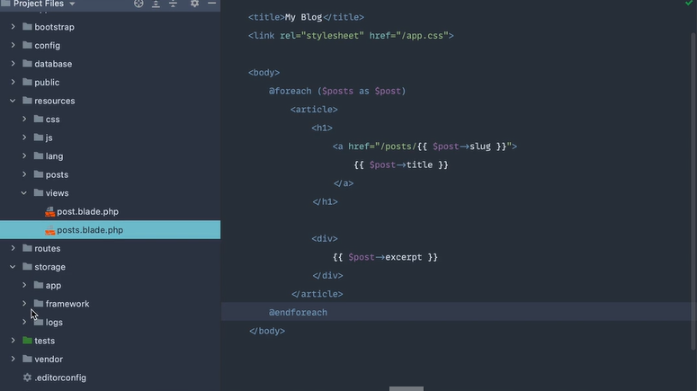
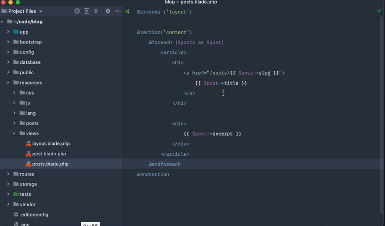
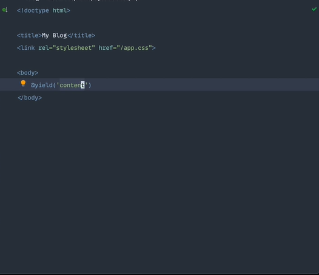

# Laravel from the scratch

En esta sección trabajaremos con los blades de la app

--------------------------------------------------------

## **Primera parte**
### Lo absolutamente básico:

En este apartado vemos como podemos renderizar los blades de distinta formas

## **Segunda parte**
### Diseños de hoja de dos maneras:

En este apartado crearemos un blade llamado layout, el cual va a obtener contenido el titulo de la pagina principal y en la pagina principal vamos a obtener ese contenido mediante un extend, tal que así:

- Página posts:

- Página del layout:

Creamos una carpeta components para tener más orden sobre nuestro código y dentro de esta carpeta introducimos el blade con el nombre layout

## **Tercera parte**
### Algunos ajustes y consideración:

En este apartado, solo se hacen pequeños cambios a las rutas que pueden ser tomados en consideración a la hora de desarrollar código de manera profesional, así como algunas validaciones extras en diferentes partes del proyecto.

[THE BASICS](../README.md)

[WORKING WITH DATABASES](../entregables/databases.md)

