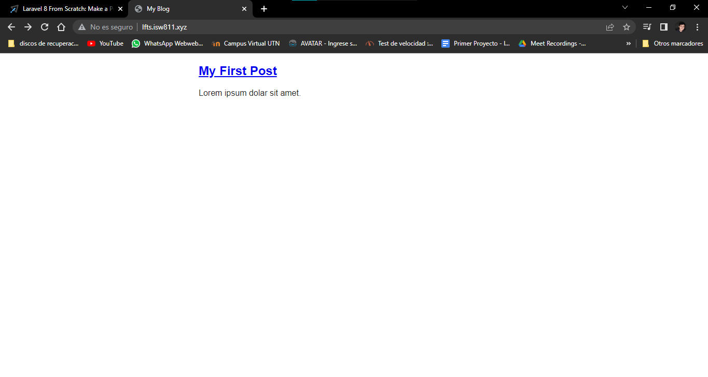
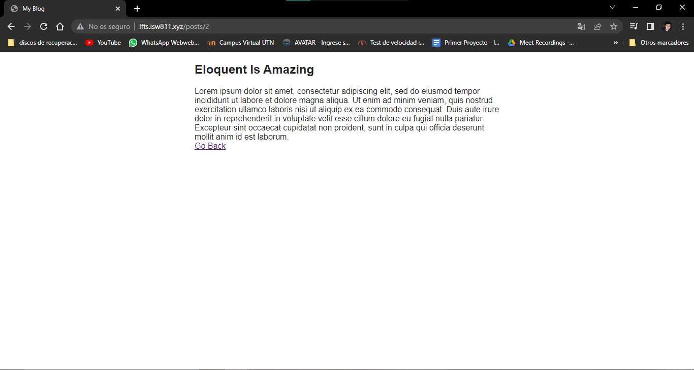
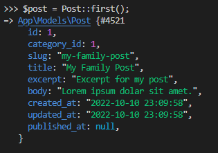
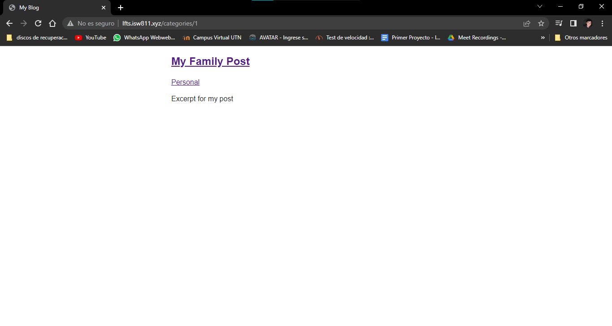
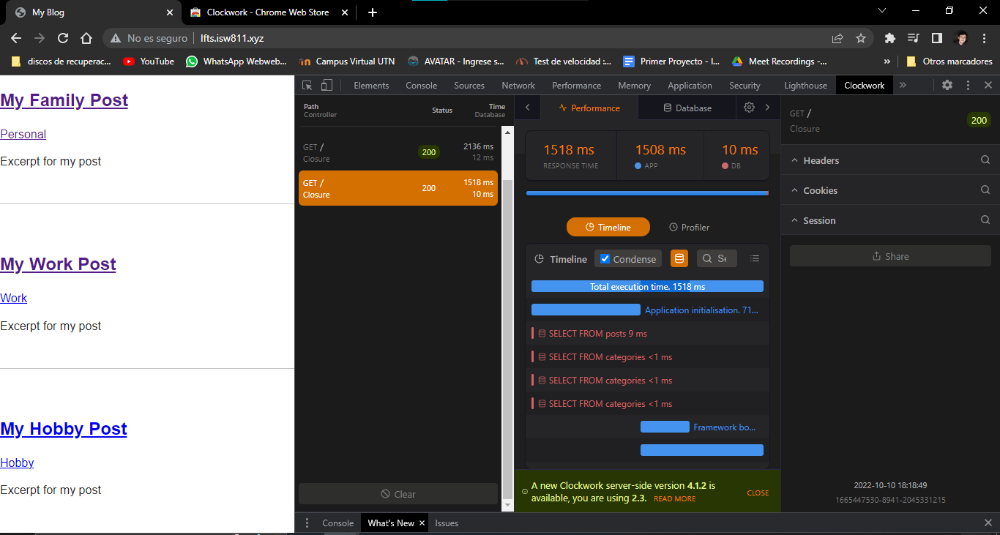
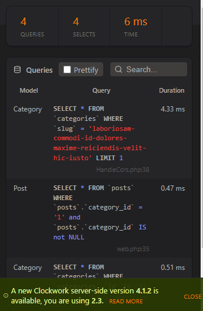

# Laravel from the scratch

En esta sección trabajaremos con bases de datos.

--------------------------------------------------------

## **Primera parte**
### Archivos de entorno y conexiones de base de datos:
--------------------------------------------------------
En este apartado, estariamos editando el archivo .env de nuestro proyecto de laravel, pero antes de esto, tenemos que hacer algunas instalaciones previas.
Dicho proceso de instalaciones se pueden ver en:
>**[Procesos previos a la cofiguracion del .env](https://gitlab.com/mizaq/lampondebian/-/blob/master/docs/db-installation.md)**

Luego de realizar estos procesos, ya estamos listos para continuar con el siguiente episodio.

## **Segunda parte**
### Migraciones: las bases absolutas:
--------------------------------------------------------
Este episodio lo comenzamos viendo primeramente la estructura de nuestra tabla user con el siguiente comando:

>*mysql -u user_laravel -p*

>introducimos la contraseña y le damos a **Enter**

>Luego usamos: *use "database_name"*

>Hacemos un *show tables*

>y por último un *describe "table_name"*

y así podremos observar la estructura de nuestra tabla

Como parte de este segundo episodio, se explica los diferentes codigos que se pueden usar para las migraciones, tales como un **rollback** que funciona para retroceder migraciones recien realizadas, un **migrate:fresh** que funciona para dropear todas las tablas que comprenden las bases de datos, con este comando se debe tener cuidado porque en un ambiente de desarrollo de produccion podria provocar graves problemas.

A continuación se muestra una imagen de lo que podria pasar si utilizamos **migrate:fresh** en un ambiente de produccion:

## **Tercera parte**
### Elocuencia y el patrón de registro activo:
--------------------------------------------------------

Para iniciar este episodio, necesitamos ingresar lineas de datos a la tabla que ya tenemos creada llamada *user*

1- Para insertar un nuevo usuario debemos ingrasar a la consola
>**php artisan tinker**

2- Creamos un nuevo usuario accediendo a la ruta donde está la clase *User*
>**$user = new App\Models\User;**

3- Ingresamos datos quemados al usuario, como mínimos vamos a utilizar el nombre, el email y una contraseña:
>**$user->name='Your_name';**

>**$user->email='Your_email';**

>**$user->password=bcrypt('Your_password');**

La palabra *bcrypt* funciona para guardar una contraseña de manera encriptada.

por último, para guardar la inserción de los datos, realizamos el siguiente comando:
>**$user->save();**

Acá podemos observar los datos que recién guardamos:

## **Cuarta parte**
### Hacer un modelo de publicación y migración:
--------------------------------------------------------
En este episodio vamos a aprender como hacer un modelo de publicación y migración con Laravel.

Como primera tarea, vamos a eliminar el modelo *Post* que habiamos creado en un inicio.

Seguidamente vamos a crear un modelo elocuente, utilizando 2 comandos del *artisan*, dichos comandos son:

>**php artisan make:migration *migration_name***

Creamos la migracion:

Luego de realizar la migracion de manera exitosa, procedemos a eliminar la carpeta de posts que teniamos en un inicio, donde se guardaban los archivos html que se mostraban en el navegador.
Continuamente procedemos a modificar la migracion que hicimos para colocar los atributos que teniamos en los archivos html.

La estructura de nuestro archivo quedaría tal que así:

>

y procedemos a realizar la migración.

Así quedaría nuestra migración:

>

Procedemos a crear un modelo con el comando

>**php artisan make:model *model_name***

Insertamos atributos en los campos de la tabla que recién creamos:

 >

 Ahora nos dirigiremos a las rutas y vamos a cambiar los parametros que recibía:

 >

 Esto es lo que deberia mostrar nuestro navegador:

 >

 >

 Ingresamos un nuevo registro a la base de datos, al ser una app que con anterioridad la hicimos dinámica, actualizamos el navegador y:

 >

 >

la magia ocurre.

## **Quinta parte**
### Actualizaciones elocuentes y escape de HTML:
--------------------------------------------------------
En este episodio vamos a ver como funciona los blogs posts cuando realizamos modificaciones en ellos.

Vamos a cambiar el body de la página y lo colocamos dentro de una etiqueta *p*

Ese cambio realizado es para que se respeten los margenes de diseño que le establecimos en un principio con el *css*.

- Con la etiqueta *p*

>

- Si la etiqueta *p*

>

## **Quinta parte**
### 3 formas de mitigar las vulnerabilidades de asignación masiva:
--------------------------------------------------------

En este episodio vamos a ver 3 formas de mitigar vulnerabilidades de asignación masiva.

Vamos a empezar creando un nuevo Post, es decir ingresar datos a la base de datos.

Creando los post de manera tradicional, atributo por atributo es una manera de insertar datos pero no es muy seguro, en capitulos anteriores creamos un modelo, cual controla todo lo que corresponde a los posts, por este motivo, una manera de segura de insertar datos y evitar la masividad es controlar las variables desde ese modelo, dentro de este modelo indentificaremos cuales son las variables que queremos que tengan datos y las que no se especifiquen ahi, serán ignoradas, por ejemplo:

>*protected $fillable = ['title', 'excerpt','body'];*

si usamos esta linea de código, solo vamos a poder insertar datos dentro de esos campos, todo lo demás será ignorado.

>

En la imagen anterior podemos ver que los datos que ingresé fueron aceptados al momento de ingresarlos porque en el modelo realizamos el *fillable*, en caso contrario, que no se especifiquen los atributos en el modelo, no se guardarán los cambios, en este caso se mostrará un error.

Otro metodo que se puede utilizar en el modelo Post, es el siguiente:

>*protected $guarded = [];*

Esta linea hace todo lo contrario a lo que hace el *fillable*, ya que el guarded va a ignorar lo que le digamos dentro de los corchetes, por ejemplo:

>*protected $guarded = ['title'];*

con esta linea, la app va a guardar toda la información que le dimos, exceptuando o ignorando el título.

## **Sexta parte**
### Enlace de modelo de ruta:
--------------------------------------------------------

En este episodio vamos a ver como hacer enlaces de modelos con rutas.

Vamos a crear un atributo nuevo dentro de la migracion que habiamos creado anteriormente, la que posee control sobre la tabla posts y ejecutamos el comando que nos permite refrescar todas las migraciones de la base de datos:

>*php artisan migrate:fresh*

Reingresamos toda la data que teniamos en un principio, luego realizamos el siguiente cambio a la ruta:

>*Route::get('posts/{post:slug}', function (Post $post) {
    return view('post', [
        'post' => $post,
    ]);
});*

debido a todos estos cambios, ahora no visualizamos el id de cada registro, sino que visualizamos el nombre de cada página

>*http://lfts.isw811.xyz/posts/my-second-post*

entonces accederemos a las paginas que antes eran html ya no por id sino por slug.

## **Setima parte**
### Tu primera relación elocuente:
--------------------------------------------------------

En este episodio vamos a aprender como realizar relaciones elocuentes dentro de nuestro proyecto de Laravel.

Para empezar, vamos a aprender como fusionar un *make:model* con un *make:migration*.

Lo anterior se realiza de la siguiente manera:

>*php artisan make:model 'model_name' -m*

y creamos un modelo junto a su migración:

>

Ahora procederemos a modificar la migración creada.
Vamos a implementarle 2 atributos nuevos

 >*$table->string('name');*

 >*$table->string('slug');*

 en cuanto a al archivo de Post, vamos a implementar una llave foránea, que será la que nos va a ayudar a conectar entre si estas 2 tablas.

 >*$table->foreignId('category_id')*

 Ingresamos datos a la base de datos, pero esta vez con la llave foranea que va a unir categorias con posts y el resutado queda tal que así:

 >

 Ahora realizado lo anterior, procedemos a ir al modelo de Post para agregar una nueva funcion llamada *category()*, donde vamos a establecer si la relación es de *uno a muchos*, de *muchos a muchos*, etc...

 >*public function category(){
        return $this->belongsTo(Category::class);
    }*

Con el comando anterior creamos una relacion elocuente entre el Post y el Category.

En la página principal realizamos un cambio el cual fue usar una etiqueta *p* y establecer la direccion que se va a conectar con ambos modelos y nos da como resultado algo así:

>

## **Octava parte**
### Mostrar todas las publicaciones asociadas con una categoría:
--------------------------------------------------------

Como bien se menciona en el subtítulo, en este episodio vamos a mostrar todas las publicaciones asociadas con una categoría.

Vamos a empezar crando una ruta que nos controle el proceso de redireccionamiento de las categorias.

Luego vamos al modelo de Category y creamos una funcion llamada posts y su return va a tener una relacion 

Acá observamos que la relación está bien:

>

Luego de visualizar que la conexion entre ambos models fue existosa, procedemos a modificar las tags que hicimos en el episodio anterior.

El resultado del proceso sería así:

>

## **Novena parte**
### Mecanismo de relojería y el problema N+1:
--------------------------------------------------------

En este episodio resolveremos algunos problemas que se presentan del episodio anterior y vamos a estudiar el mecanísmo de relojería

El problema que se presenta del episodio anterior es que por cada consulta que hagamos a la base de datos el sistema va a generar consultas la cantidad de indormacion que esté guardada en la base de datos, es decir, si tengo 3 Posts registrados en mi base de datos, se van a generar 3 consultas, 1 por cada item.

Para evitar este problema vamos a instalar el Clockwork con el siguiente comando:

>*composer require itsgoingd/clockwork*

Aplicamos los cambios y descargamos la extension para nuestro navegador y queda así:

>

Aplicamos la siguiente linea a la ruta principal

>*'posts' => Post::with('category')->get()*

y tenemos como resultado lo siguiente:

>

## **Décima parte**
### Enviando tiempos de guardado a la base de datos:
--------------------------------------------------------

En este episodio, vamos primeramente a hacer que se muestre el usuario en pantalla con su respectiva categoria.

Primeramente vamos a ir a los campos de la tabla post que se encuentran en la migración que habiamos realizado en episodios pasados y vamos a agregar lo siguiente:

>*$table->foreignId('user_id')*

Con el fin de obtener el id de cada usuario registrado con su respectiva categoria.

Seguidamente para aplicar los cambios haremos el comando que ya sabemos:

>*php artisan migrate:fresh*

Una vez que refrescamos las migraciones con sus respectivos cambios perderemos todos los datos que teniamos en un principio en la base de datos.
Para evitar tener que estar realizando un procedimento tan largo como lo es insertar datos vamos a utilizar los seeder que nos propicia el mismo Laravel.

Para ello vamos a utilizar:

>*php artisan db:seed*

una vez aplicado, vamos a encontrar datos de prueba en las tabla especificada.

En seeder vamos a realizar unos pequeños cambios, ya que necesitamos establecer una categoria al usuario. Hcemos lo siguiente:

>*$user = User::factory()->create();*

para crear un único usuario, luego creamos nuestras cateogirias:

>*Category::create([  
            'name' => 'category_name',   
            'slug' => 'category_slug',  
        ]);*

este proceso lo haremos la cantidad de veces que lo necesitemos, de momento, hay que resaltar que este metodo es especifico de un ambiente de desarrollo local.

Una vez implementado el comando anterior, vamos a dirigirnos a la migración de las categorias y le vamos a dar un ***unique()*** y en los seeder vamos a implementar un ***truncate()*** para que no se me clonen los datos en la base de datos.

Vamos a implementar lo mismo para los post, vamos a asignar una variable a las categorias y junto a las llaves foraneas las vamos a incluir dentro del arreglo donde se crean los *Post* para crear las relaciones.

Al finalizar vamos a la clase Post y realizamos una función pública que permita controlar los *Users* y le implementamos un 

>***return $this->belongsTo(User::class)***

Luego a la clase de *User* le establecemos lo siguiente:

>***return $this->hasMany(Post::class)***

Por último, vamos al blade y establecemos una etiqueta *a* pero esta vez invocando al usuario desde la base de datos.

## **Undécima parte**
### Turbo Boost With Factories:
--------------------------------------------------------

En este episodio vamos a utilizar los archivos ***Factory*** para acelear los procesos de nuestra app.

Creamos un ***Factory*** para los *Post*:

>***php artisan make:factory "factory_name"***

Vamos a continuar trabajando con el *factory* creado, vamos a darle una serie de atributos como lo son el *title*, *excerpt* y el *body*, luego le agregamos un *user_id* tal que así:

>***'user_id' => User::factory();***

>***'category_id' => Category::factory();***

Con esto lo que estamos haciendo es quecada vez que creemos un post nuevo, este se encargue de crearme un usuario y una categoria por cada post creado.

Creamos un ***CategoryFactory*** y le damos las credenciales que corresponden, luego agregamos el *slug* al ***PostFactory***

Seguidamente vamos al los *seeders*, comentamos lo que teniamos del capitulo anterior y ingresamos lo siguiente:

>***$user = User::factory()->create();***

>***Post::factory()->create();***

de esta manera con la primera linea de codigo podemos crear un usuario y dentro de los *( )* podremos colocar el nombre que queramos, este solo modificará el campo name de la base de datos en la tabla *users* y todos los demás campos de esa tabla serán datos randoms.

Luego en el ***create()*** de *Post* le asignaremos el id del usuario que creamos.

## **Duodécima parte**
### Ver todos los Posts por Autor:
--------------------------------------------------------

En este episodio vamos a aprender como mostrar los posts realizados por usuarios registrados,
al momento de dar click en el usuario, este nos muestre todos los posts que están registrados con ese usuario.

Primeramente solucionaremos el problema de que cuando agregamos un nuevo post, este se muestra al final y no al principio de la página.

Nos dirigimos al archivo de rutas y establecemos lo siguiente:

>***''posts' => Post::latest()->with('category', 'author')->get()***

Ahora para términos más profesionales, vamos a cambiar el método user que está en el modelo *Post* y lo vamos a llamar ***author***
y como segundo parámetro en el *belongsTo()* le vamos a dar el nombre de la llave foránea que vamos a utilizar, ejemplo:

>***return $this->belongsTo(User::class, 'user_id');***

Con todos los cambios realizados anteriormente, si utilizamos el clockwork veremos que no realizamos consultas innecesarias:

>

Ahora creamos una ruta nueva donde se nos muestre los posts leidos por el usuario:

>***Route::get('authors/{author}', function (User $author) { 
    return view('posts', [ 
        'posts' => $author->posts 
    ]); 
});***

cambiamos el *href* de la etiqueta *a* para que se nos aplique el cambio realizado en el comentario previo a este.

Ahora para concluir con este capítulo, en la ruta se nos muestra el id del usuario al que estamos accediendo para ver los *Posts* leidos por el mismo, entonces vamos a hacer que no se muestre el id sino que se muestre un ***username***.

En la migración donde creamos la tabla de usuarios agregamos lo siguiente:

>***$table->string('username')->unique();***

luego nos vamos a el *UserFactory* e incluimos el username.
 
 >***'username' => $this->faker->unique()->userName()***

refrescamos las migraciones añadiendo un *--seed*
cambiamos ***{{ $post->author->id }}*** por ***{{ $post->author->username }}***
 
agregamos el parametro ***username*** a la ruta que realizamos anteriormente y listo.

## **Décimo tercera parte**
### Relaciones de carga ansiosa en un modelo existente:
--------------------------------------------------------

En este episodio vamos a aprender coo evitar consultas ansiosas al momento de trabajar con *posts* dentro de una misma categoría, vamos a optimizar las consultas.

Cambiamos estas 2 lineas de código en las rutas:

>***'posts' => $category->posts->load(['category', 'author'])***
>***'posts' => $author->posts->load(['category', 'author'])***

con este cambio, hacemos que no se realicen consultas de más al evaluar una sola categoría.

Para que todas las consultas queden mejor optimizadas, vamos a dirigirnos a la clase *Post* y vamos a agregar:

>***protected $with = ['category', 'author'];***

y eliminamos los cambios que habiamos dejado a las rutas y listo, hemos optimizado las consultas que se realizan a la base de datos.

>

[Integrate the Design](../entregables/integrating_desing.md)