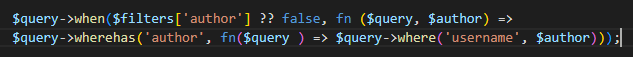
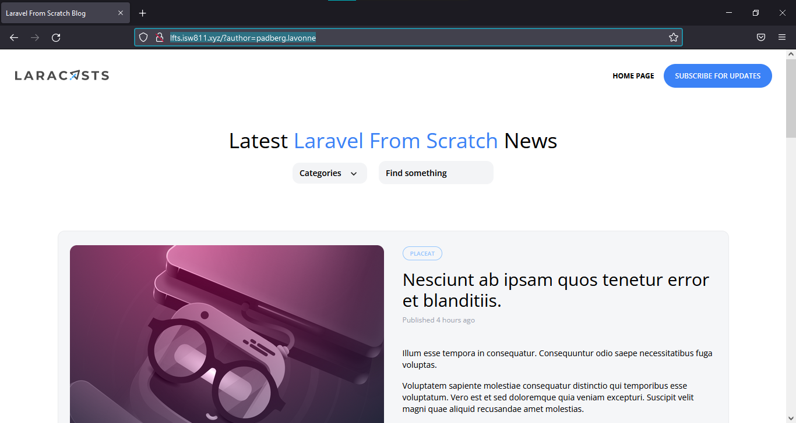
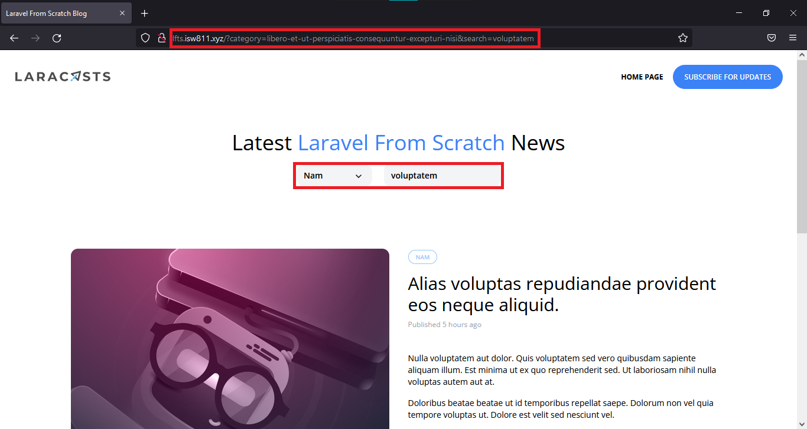
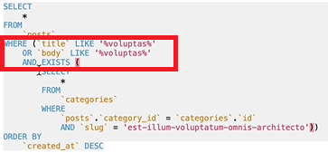

# Laravel from the scratch

En esta sección trabajaremos el apartado de filtros

--------------------------------------------------------

## **Primera parte**
### Restricciones avanzadas de consultas elocuentes:
--------------------------------------------------------

Para comenzar con este episodio, vamos a cargar todos los posts que estan asociados a una categoría.

En primer lugar vamos a la función *index* creada en el controlador de los posts y lo cambiamos tal que así:

    public function index()
    {
        return view('posts', [
            'posts' => Post::latest()->filter(request(['search', 'category']))->get(),
            'categories' => Category::all()
        ]);
    }

Luego vamos al método *scopeFilter* y realizamos una de 2 opciones:

1- Cambiamos el método

2- Duplicamos el método

en este caso utilizaremos la opción 2 y le haremos algunos cambios al código que acabamos de duplicar.

Entonces, una vez duplicado el código lo vamos a modificar, de manera que al realizar el *query* este sea interpretado de manera correcta por la app:

>***$query->when($filters['category'] ?? false, fn ($query, $category) =>
        $query->wherehas('category', fn($query ) => $query->where('slug', $category)));***

En el *PostController* agregramos el *currentCategory* para que basado en la programación que hicimos en anteriores videos, este cargue la categoría actual en el dropdown, y la ruta que teniamos anteriormente la vamos a eliminar porque ya no será necesaria.

--------------------------------------------------------

## **Segunda parte**
### Extreyendo una categoria del la pagina con el componente dropdown:
--------------------------------------------------------

Vamos a cambiar un poco el *_posts-header.blade.php*.

En el blade mencionado, vamos a cortar el dropdown que tenemos ahí y vamos a crear un algoritmo nuevo.
Creamos un nuevo componente llamado *CategoryDropdown* que va a tener el archivo dropdown que cortamos en el *_posts-header.blade.php*.
El archivo creado retorna una vista, a esa vista le añadimos todas las categorias que traermos de la base de datos. Como realizamos este cambio, ya no necesitamos más pasarle las categorias por rutas a los objetos del proyecto, por ende esas referencias las podemos eliminar de las rutas y del controlador.
Al realizar estos cambios, de nuevo tendremos el problema de que no se va a mostrar la categoria en la que estamos sistuados en la página, para resolverlo solamente movemos:

>***'currentCategory' => Category::firstWhere('slug', request('category'))***

al componente del dropdown que creamos al inicio y listo.

--------------------------------------------------------

## **Tercera parte**
### Filtro por autor:
--------------------------------------------------------

Vamos a realizar un filtro por autores.

Nos dirigimos al archivo *post-card.blade.php* y donde tenemos el nombre del autor prodecedemos a establecerlo como un elemento clickeable.
En la ruta agregamos un *.index* para que el render nos reconozca la página, ya que en el capitulo anterior para limpiar un poco el código metimos las vistas principales en una carpeta y les cambiamos el nombre.
Consiguientemente vamos al modelo *Post* y hacemos lo siguiente:

> 

luego nos dirigimos al controlador de los posts, en el request agregamos *author*, probamos y:

> 

> **Importante:** Podemos combinar los métodos de filtrado, es decir, podemos clickear en un autor, luego dentro de eso podemos realizar búsqueda de palabras, etc...

Como ya sabemos, al agregar: ***"/?author={{ $post->author->username }}"*** a la ruta de cada pantalla podremos eliminar la ruta que utilizabamos para eso.

--------------------------------------------------------

## **Cuarta parte**
### Combinar categorías y consultas de búsqueda:
--------------------------------------------------------

En el *action* del *_header.blade.php* vamos a obtener tambien lo que pongamos en el text field de buscar para poder hacer un match entre la categoría y la búsqueda.
> ***action="/?{{ request()->getQueryString() }}"***
Una vez hecho esto, no vamos a tener ningún resultado, porque tiene que ser aplicado en cada form.

Otra opción es crear un *input* de tipo *hidden* para que se almacene el resultado de la búsqueda que vamos a realizar junto al filtro de la categoría.

Luego de realizar de manera correcta el seleccionar una categoría y buscar una palabra sin que la categoria se resetee, vamos hacer el mismo procedimiento pero esta vez vamos a hacerlo que cuando busquemos una palabra podamos seleccionar una categoría sin perder la palabra que estabamos buscando.

Nos dirigimos al *category-dropdown.blade.php* y buscamos nuestro item de dropdown, una vez estando ahí, nos dirigimos a la ruta que está en *x-dropdown-item* y a la ruta del *href* le asignamos lo siguiente:

>***"/?category={{ $category->slug }}&{{ http_build_query(request()->except('category')) }}"***

de esta manera nos aseguramos de poder buscar una palabra y consiguientemente buscar una categoría sin perder la palabra que estabamos buscando.

Si todo va bien se debería de mostrar algo así:

>

--------------------------------------------------------

## **Quinta parte**
### Arreglar un error de consulta elocuente confuso:
--------------------------------------------------------

En este episodio, vamos a solucionar un pequeño bug que encontraremos en nuestra app, el bug es que efectivamente el sistema busca por categoría y tambien por palabras y visceversa, pero si scrolleamos hacia abajo vamos a ver que **encuentra la palabra clave pero con una categoría distinta**,
entonces vamos a solucionarlo.

Bien, para solucionar este problema, nos vamos a nuestro gestor de base de datos o bien el clockwork que instalamos en versiones anteriores, en cualquiera de estos 2 sitios podremos ver la consulta que estamos realizando, el problema radica en que al momento de hacer la consulta se ve algo así:

>

como podemos observar en la imagen, el error está en la clausula *AND EXIST*, esa clausula debemos colocarla fuera del *WHERE* que vemos encerrado en la imagen, de esta manera solucionaremos el error o pequeño bug.

En el código nos dirigimos al modelo *Post*, en el *scopeFilter* colocamos lo siguiente:

***$query->when($filters['search'] ?? false, fn ($query, $search) =>
        $query->where(fn ($query) =>
        $query->where('title', 'like', '%' . request('search') . '%')
            ->orWhere('body', 'like', '%' . request('search') . '%')));***

y listo, bug solucionado.

[PAGINATION](../entregables/pagination.md)