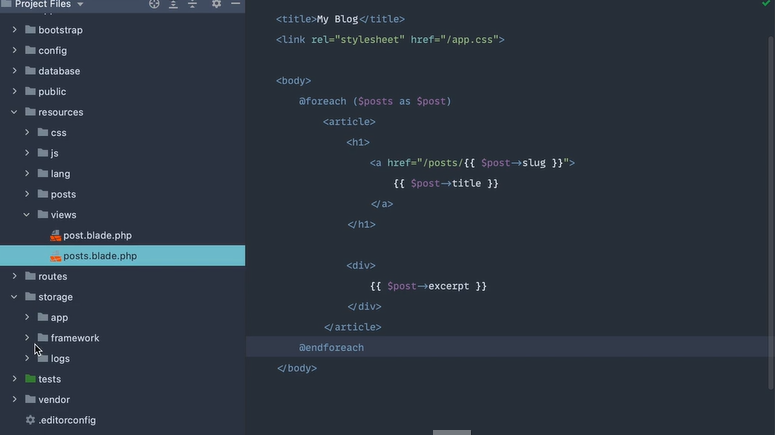

# Laravel from the scratch

En esta sección trabajaremos con los blades de la app

--------------------------------------------------------

## **Primera parte**
### Como una ruta carga las vistas:

En este apartado vemos como podemos renderizar los blades de distinta formas

