# Laravel from the scratch

En esta sección trabajaremos con bases de datos.

--------------------------------------------------------

## **Primera parte**
### Archivos de entorno y conexiones de base de datos:
--------------------------------------------------------
En este apartado, estariamos editando el archivo .env de nuestro proyecto de laravel, pero antes de esto, tenemos que hacer algunas instalaciones previas.
Dicho proceso de instalaciones se pueden ver en:
>**[Procesos previos a la cofiguracion del .env](https://gitlab.com/mizaq/lampondebian/-/blob/master/docs/db-installation.md)**

Luego de realizar estos procesos, ya estamos listos para continuar con el siguiente episodio.

## **Segunda parte**
### Migraciones: las bases absolutas:
--------------------------------------------------------
Este episodio lo comenzamos viendo primeramente la estructura de nuestra tabla user con el siguiente comando:

>*mysql -u user_laravel -p*

>introducimos la contraseña y le damos a **Enter**

>Luego usamos: *use "database_name"*

>Hacemos un *show tables*

>y por último un *describe "table_name"*

y así podremos observar la estructura de nuestra tabla

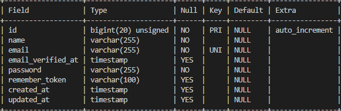

Como parte de este segundo episodio, se explica los diferentes codigos que se pueden usar para las migraciones, tales como un **rollback** que funciona para retroceder migraciones recien realizadas, un **migrate:fresh** que funciona para dropear todas las tablas que comprenden las bases de datos, con este comando se debe tener cuidado porque en un ambiente de desarrollo de produccion podria provocar graves problemas.

A continuación se muestra una imagen de lo que podria pasar si utilizamos **migrate:fresh** en un ambiente de produccion:

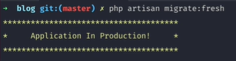

## **Tercera parte**
### Elocuencia y el patrón de registro activo:
--------------------------------------------------------

Para iniciar este episodio, necesitamos ingresar lineas de datos a la tabla que ya tenemos creada llamada *user*

1- Para insertar un nuevo usuario debemos ingrasar a la consola
>**php artisan tinker**

2- Creamos un nuevo usuario accediendo a la ruta donde está la clase *User*
>**$user = new App\Models\User;**

3- Ingresamos datos quemados al usuario, como mínimos vamos a utilizar el nombre, el email y una contraseña:
>**$user->name='Your_name';**

>**$user->email='Your_email';**

>**$user->password=bcrypt('Your_password');**

La palabra *bcrypt* funciona para guardar una contraseña de manera encriptada.

por último, para guardar la inserción de los datos, realizamos el siguiente comando:
>**$user->save();**

Acá podemos observar los datos que recién guardamos:

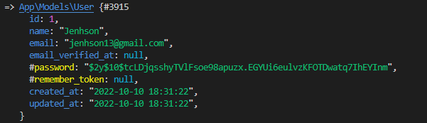

## **Cuarta parte**
### Hacer un modelo de publicación y migración:
--------------------------------------------------------
En este episodio vamos a aprender como hacer un modelo de publicación y migración con Laravel.

Como primera tarea, vamos a eliminar el modelo *Post* que habiamos creado en un inicio.

Seguidamente vamos a crear un modelo elocuente, utilizando 2 comandos del *artisan*, dichos comandos son:

>**php artisan make:migration *migration_name***

Creamos la migracion:

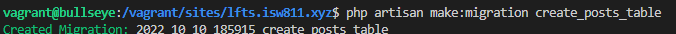

Luego de realizar la migracion de manera exitosa, procedemos a eliminar la carpeta de posts que teniamos en un inicio, donde se guardaban los archivos html que se mostraban en el navegador.
Continuamente procedemos a modificar la migracion que hicimos para colocar los atributos que teniamos en los archivos html.

La estructura de nuestro archivo quedaría tal que así:

>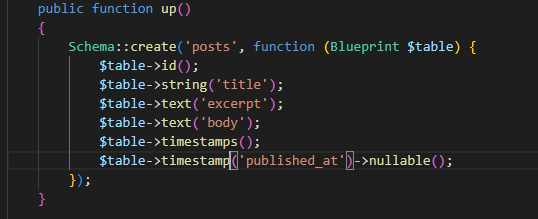

y procedemos a realizar la migración.

Así quedaría nuestra migración:

>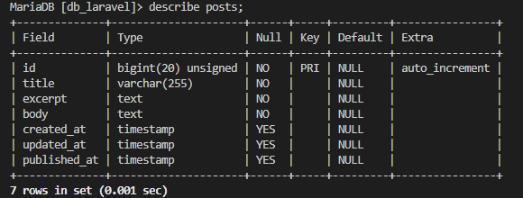

Procedemos a crear un modelo con el comando

>**php artisan make:model *model_name***

Insertamos atributos en los campos de la tabla que recién creamos:

 >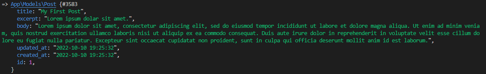

 Ahora nos dirigiremos a las rutas y vamos a cambiar los parametros que recibía:

 >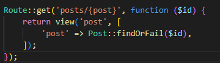

 Esto es lo que deberia mostrar nuestro navegador:

 >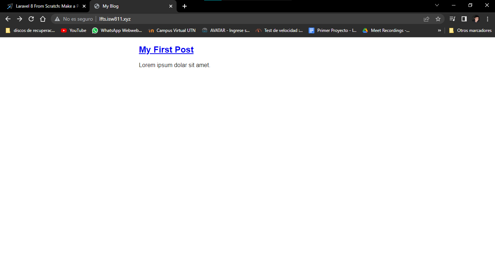

 >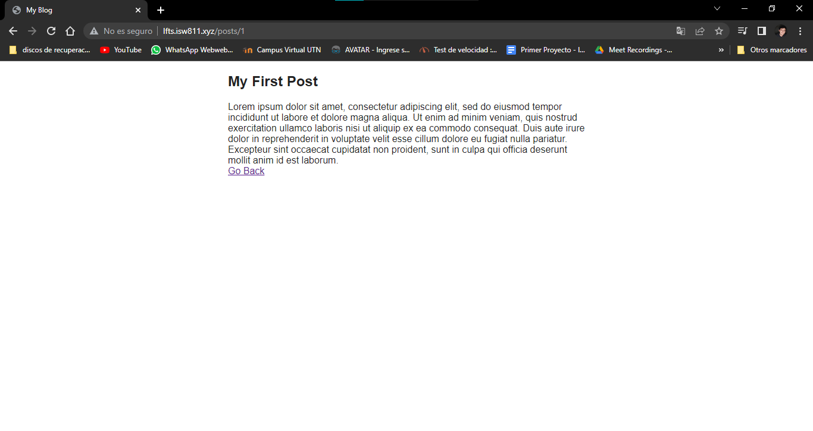

 Ingresamos un nuevo registro a la base de datos, al ser una app que con anterioridad la hicimos dinámica, actualizamos el navegador y:

 >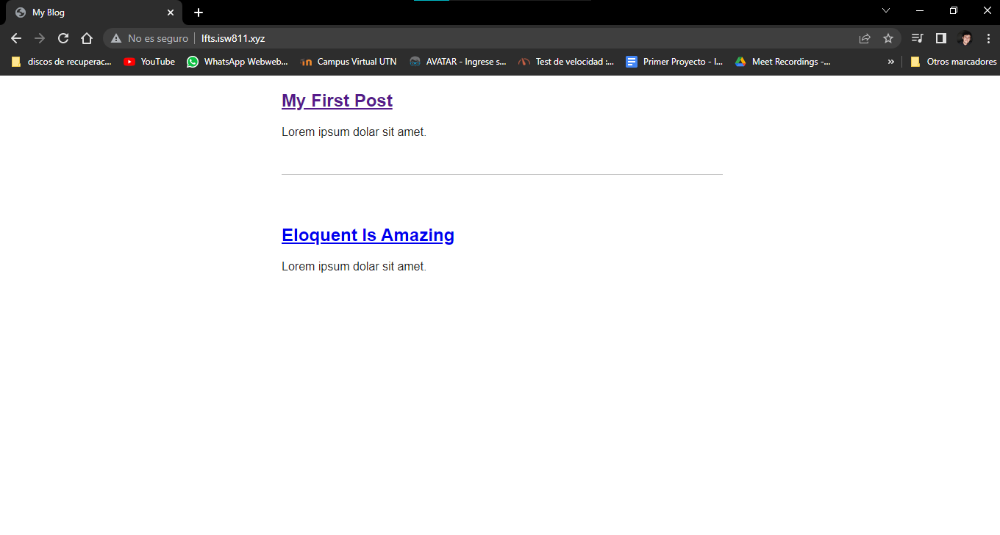

 >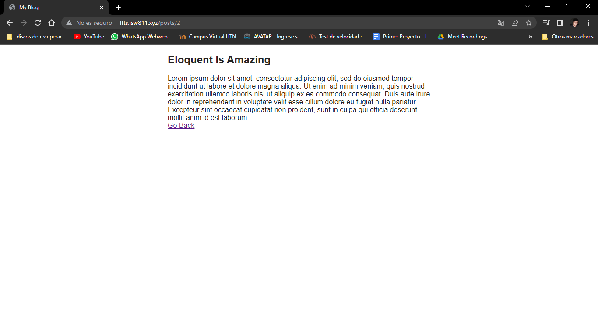

la magia ocurre.

## **Quinta parte**
### Actualizaciones elocuentes y escape de HTML:
--------------------------------------------------------
En este episodio vamos a ver como funciona los blogs posts cuando realizamos modificaciones en ellos.

Vamos a cambiar el body de la página y lo colocamos dentro de una etiqueta *p*

Ese cambio realizado es para que se respeten los margenes de diseño que le establecimos en un principio con el *css*.

- Con la etiqueta *p*

>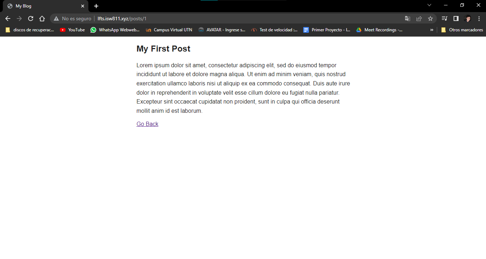

- Si la etiqueta *p*

>

## **Quinta parte**
### 3 formas de mitigar las vulnerabilidades de asignación masiva:
--------------------------------------------------------

En este episodio vamos a ver 3 formas de mitigar vulnerabilidades de asignación masiva.

Vamos a empezar creando un nuevo Post, es decir ingresar datos a la base de datos.

Creando los post de manera tradicional, atributo por atributo es una manera de insertar datos pero no es muy seguro, en capitulos anteriores creamos un modelo, cual controla todo lo que corresponde a los posts, por este motivo, una manera de segura de insertar datos y evitar la masividad es controlar las variables desde ese modelo, dentro de este modelo indentificaremos cuales son las variables que queremos que tengan datos y las que no se especifiquen ahi, serán ignoradas, por ejemplo:

>*protected $fillable = ['title', 'excerpt','body'];*

si usamos esta linea de código, solo vamos a poder insertar datos dentro de esos campos, todo lo demás será ignorado.

>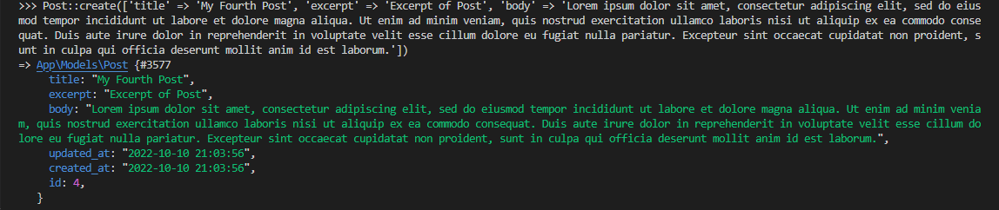

En la imagen anterior podemos ver que los datos que ingresé fueron aceptados al momento de ingresarlos porque en el modelo realizamos el *fillable*, en caso contrario, que no se especifiquen los atributos en el modelo, no se guardarán los cambios, en este caso se mostrará un error.

Otro metodo que se puede utilizar en el modelo Post, es el siguiente:

>*protected $guarded = [];*

Esta linea hace todo lo contrario a lo que hace el *fillable*, ya que el guarded va a ignorar lo que le digamos dentro de los corchetes, por ejemplo:

>*protected $guarded = ['title'];*

con esta linea, la app va a guardar toda la información que le dimos, exceptuando o ignorando el título.

## **Sexta parte**
### Enlace de modelo de ruta:
--------------------------------------------------------

En este episodio vamos a ver como hacer enlaces de modelos con rutas.

Vamos a crear un atributo nuevo dentro de la migracion que habiamos creado anteriormente, la que posee control sobre la tabla posts y ejecutamos el comando que nos permite refrescar todas las migraciones de la base de datos:

>*php artisan migrate:fresh*

Reingresamos toda la data que teniamos en un principio, luego realizamos el siguiente cambio a la ruta:

>*Route::get('posts/{post:slug}', function (Post $post) {
    return view('post', [
        'post' => $post,
    ]);
});*

debido a todos estos cambios, ahora no visualizamos el id de cada registro, sino que visualizamos el nombre de cada página

>*http://lfts.isw811.xyz/posts/my-second-post*

entonces accederemos a las paginas que antes eran html ya no por id sino por slug.

