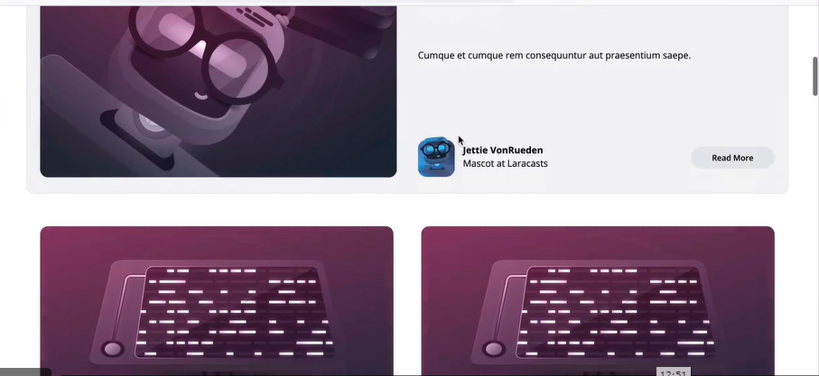
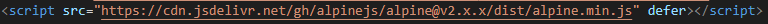
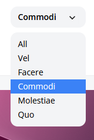

# Laravel from the scratch

En esta sección trabajaremos integración de diseño a nuestra app

--------------------------------------------------------

## **Primera parte**
### Convirtiendo el html y el css a Página:
--------------------------------------------------------
En este capítulo, vamos a implementar el html y el css como una página de estilo profesional

Primeramente descargamos el archivo que nos deja el guia en su repositorio de ***GitHub***

[Recursos para el capítulo 1 del episodio 5]('https://github.com/laracasts/Laravel-From-Scratch-HTML-CSS')

Luego de obtener los recursos necesarios como lo fue el *index.html* y la carpeta *images* procedemos a copiar y pegar la carpeta *images* en el folder *public* de nuestro proyecto, luego en el archivo que está en la carpeta *components* llamado *layout.blade.php* tomamos la info que se nos da en el repositorio y procedemos a copiar y pegar esa info en el archivo *layout.blade.php*.

Seguidamente tomamos el *body* de esa copia que realizamos y lo reemplazamos la información que habia en nuestro archivo de *posts.blade.php*, luego de haber realizado esto, separamos algunos articulos en carpetas distintas para que el documento de *posts* se redujera lo máximo posible y de esa manera poder tener un mejor orden de los archivos.

--------------------------------------------------------

## **Segunda parte**
### Componentes de las páginas y rejillas CSS:
--------------------------------------------------------

En este capítulo vamos a trabajar y aprender acerca de los componentes de los blades y las rejillas del CSS.

Luego de haber superado el capítulo 1 del episodio 5, procedimos a modificar algunos detalles del codigo como por ejemplo:

* Procedimos a crear algunos archivos *components* nuevos para tener un mayor orden y control de estos.
* Establecimos margenes en los encabezados de cada *post* creado.
* Solucionamos un error el cual si no habian registros de *posts* el sistema se caía y otro error que cuando solo habia un *post*, este cargaba aun así las otras secciones pero esta vez vacías.
* Los títulos, y demás elementos que conforman la app en cuanto a los *posts* se refiere, son los que tenemos guardados en la base de datos que hicimos en capítulos anteriores y no los predeterminados por el repositorio que nos brindó el guía.

***Resultado de lo anterior mencionado***

--------------------------------------------------------

## **Tercera parte**
### Convirtiendo the blog post page:
--------------------------------------------------------

En este episodio vamos a trabajar con el archivo *post.blade.php*

En este episodio simplemente hicimos el archivo *post.blade.php* dinámico, cambiando los textos quemados por la información que tenemos guardado en base de datos.

- [Archivo necesario para el inicio del capítulo]("https://github.com/laracasts/Laravel-From-Scratch-HTML-CSS/blob/main/post.html")

También para hacer más dinámico el código, creamos un archivo *category-button.blade.php* el cual almacena las categorias

--------------------------------------------------------

## **Cuarta parte**
### Un pequeño Dropdown con JavaScript:
--------------------------------------------------------

En este episodio vamos a crear un pequeño dropdown con JavaScript.

En este episodio tabajamos en crear un Dropdown de manera que este fuese dinámico, y bonito, para crearlo se siguieron una serie de pasos los cuales nos llevaron a completar la tarea.

- Primeramente, obtuvimos las categorias de la base de datos, para eso tuvimos que modificar las rutas y obtener las categorias desde ahí, ejemplo:

> ***'categories' => Category::all()***

- Cabe mencionar que antes de realizar el paso anterior, debiamos implementar una 'libreria', la cual nos ayudaría en el proceso para implementar JavaScript en el dropdown.

> 

- Finalmente le dimos un poco de formato al dropdown usando etiquetas de diseño de JavaScript y el resultado final fue así:

>

--------------------------------------------------------

## **Quinta parte**
### Como extraer un Dropdown de un componente blade:
--------------------------------------------------------

En este episodio vamos a seguir trabajando con el dropdown, esta vez creandolo en un vlade.

Creamos un *dropdown.blade.php* en la carpeta *components*, extraemos todo lo que trabajamos en el episodio anterior.

Pasamos los *link* del dropdown al archivo *_post-header.blade.php* y en el archivo que creamos nuevo *"dropdown.blade.php"* agregamos la etiqueta "{{ $slot }}".
Los componetes tipo *trigger* los cortamos y en el archivo *dropdown.blade.php* creamos una etiqueta **div** con el controlador del boton *@click* y dentro de esta seteamos *{{ $trigger }}*.
En el archivo *_post-header.blade.php* creamos una etiqueta *slot* y dentro de esta vamos a colocar el código del trigger que teniamos en *"dropdown.blade.php"*.
Creamos un *dropdown-item.blade.php* para no tener que repetir el css en cada dropdown que hagamos.
Establecemos una condición que determine si el dropdown está activo o no.
Damos nombres a las rutas, con el fin de optimizar el proceso que realiza el dropdown y acortar un poco el código, para que así al momento de acceder a las categorias desde el navegador, este los convalide.
Modificamos un poco el algoritmo para el item que tiene todo dropdown y hacer lo mismo que hicimos anteriormente, colocarlo en un blade aparte y mandarlo a llamar desde la pagina los renderiza.